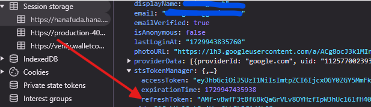

# Auto Deposit ETH Base for HANA Network / Auto Play Games

## Prerequisites
- Python3.10 or higher
- Python environment
- Pip or Pip3
- Screen

## Instalation
```bash
git clone https://github.com/ryzwan29/hana-tf-games.git
cd hana-tf-games
```
Create screen
```
screen -R
```
Create Python environment
```
python3 -m venv hana
```
Activte environment
```
source hana/bin/activate
```
install the packages
```
pip3 install -r requirements.txt
```
**Edit pvkey.txt and input Private Key**
```
nano pvkey.txt
```
**Edit token.txt and input Refresh Token**
```
nano token.txt
```

run the script
```
python3 main.py
```
**choose 1 to do transactions** or
**choose 2 to do playgames (grows&garden)**
## Run grow and open garden boxes

**First You Need To Get Your Refresh Token**
- Open Hana Dashboard : https://hanafuda.hana.network/dashboard
- Click F12 to open console
- Find Application and choose session storage
- Select hana and copy your refreshToken

- Edit token.txt paste your refresh token